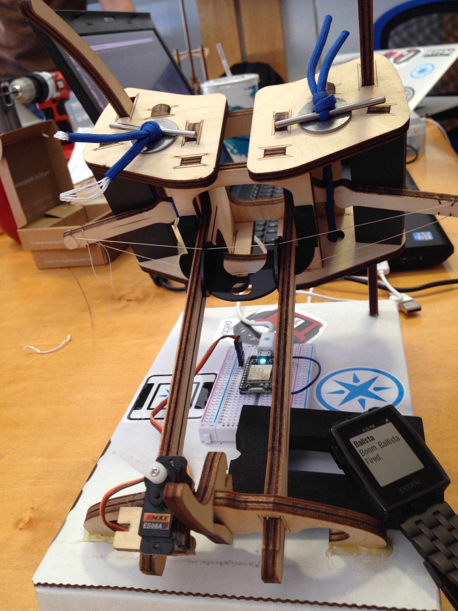

pebble-ballista
===============

Launch a [Spark Core](http://spark.io) powered ballista or catapult missile at your foes with a [Pebble](http://getpebble.com) smart watch.

How to Use
---

Provided you have a [ballista](http://www.em-labs.com/collections/all/products/the-ballista), Pebble, servo, and a Spark Core, you too can slay your foes.

- Wire up and glue a servo to the ballista to control the trigger.
- Drop the `www` code on a web server
- Upload, compile, and install the simply.js pebble code to your watch via cloudpebble.net
- Upload, compile, and flash spark.io/build

Tap the watch buttons and watch the missiles fly.

